<div align="center">

# Our spending

**A shared spending tracker for households: couples, families or housemates. Purchases are logged the moment you tap your phone, bank statements fill in the rest, and nothing gets counted twice.**

Free to run on your own Supabase + Vercel · Installable app for iPhone and Android · Your data never leaves your database

[](https://vercel.com/new/clone?repository-url=https%3A%2F%2Fgithub.com%2FNebojsha-2026%2Four-spending&project-name=our-spending&repository-name=our-spending&integration-ids=oac_VqOgBHqhEoFTPzGkPd7L0iH6&demo-title=Our%20spending&demo-description=Shared%20household%20spending%20tracker%20with%20tap-to-pay%20capture)
&nbsp;
[](https://buymeacoffee.com/npetreski)
&nbsp;
[](LICENSE)

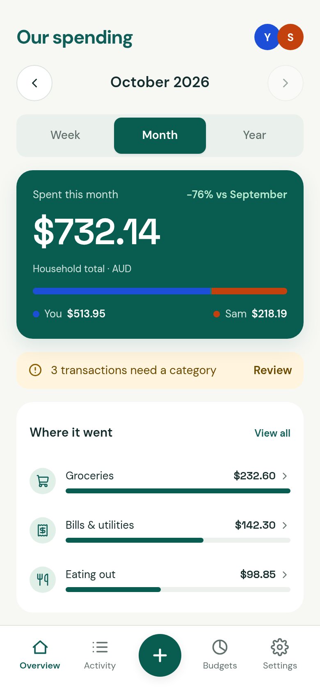
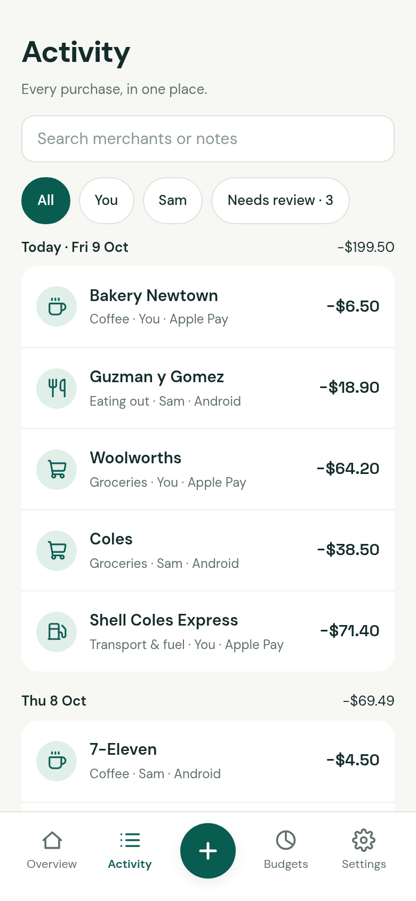
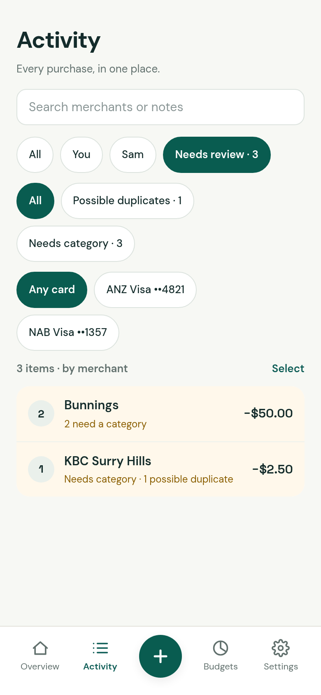
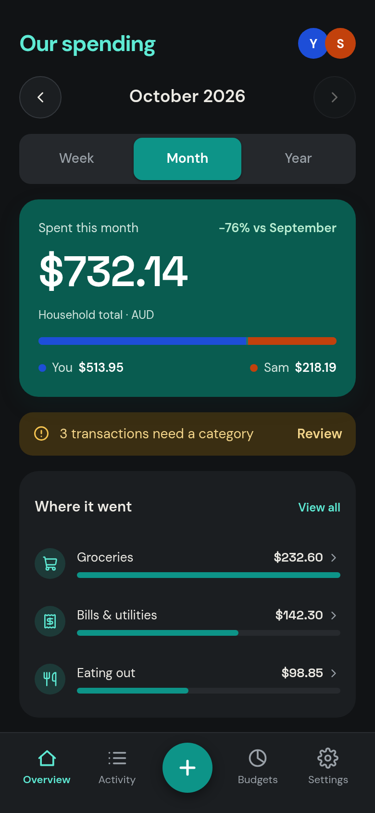

</div>

## New in 1.1.0

A refreshed design, quicker spending entry, and **Light / Dark / System** themes under *Settings → Appearance*. Your theme choice stays on your device. Existing households can update normally; no additional configuration or database migration is needed for this release. [See the changelog](CHANGELOG.md).

## Why

Most budgeting apps want a monthly fee and a login to your bank, or they make you type in every coffee. This app does neither:

- **Tap to pay, it's logged.** An iPhone Shortcut (Apple Pay) and MacroDroid on Android (Google Wallet or bank-app notifications) send each purchase to your app as you pay. You get *"Logged $4.50 · Coffee"* before you've put the phone away.
- **Bank CSV fills the gaps.** Once a month, import your bank's CSV export. Rows that match a phone capture confirm it instead of adding a copy. Cash purchases you typed in are matched too, and anything uncertain is flagged for you to merge with one tap.
- **Sorts itself out.** Messy bank text like `V4821 28/09 7-ELEVEN 2045 SYDNEY` becomes *7-Eleven*. Pick a category once with **Always** and every past and future 7-Eleven follows. Rules can depend on the amount (under $10 → Coffee, $50+ → Fuel).
- **Built for sharing.** Every transaction shows who spent it. The dashboard splits the total between everyone in the household, by category, week, month or year. It works best for 2–4 people. Tap a category to see what's in it.
- **Yours.** It runs on your own free Supabase database and Vercel hosting. No ads, no tracking, no third party in between. Export everything to CSV anytime.

- **Warns you before the month is gone.** Set a monthly budget per category and everyone's phone gets a notification when one reaches 80% and again at 100%: *"Eating out: 82% of budget · $72 left for 11 days"*.

Also included: a short welcome tour, budgets with a daily pace, a Needs review queue with bulk actions, categories that don't count as spending (transfers, paying someone back), dark mode, and Google or email-code sign-in.

<details>
<summary>More screenshots</summary>

| | | |
|---|---|---|
| 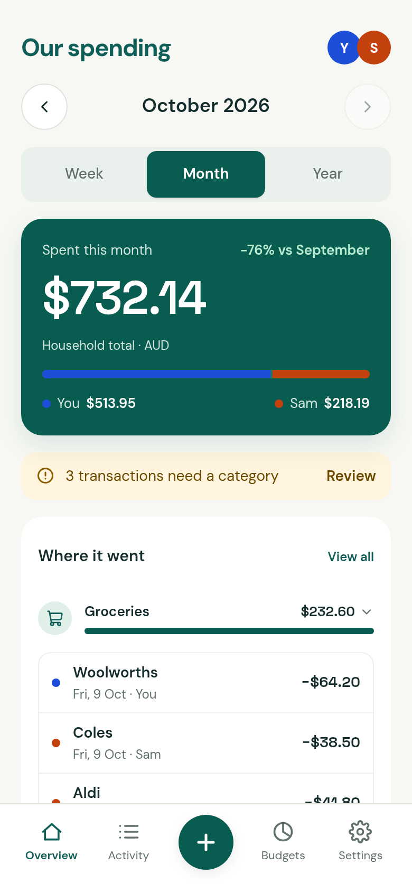 | 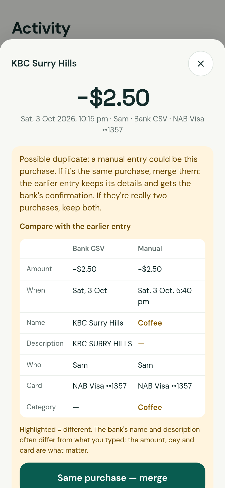 | 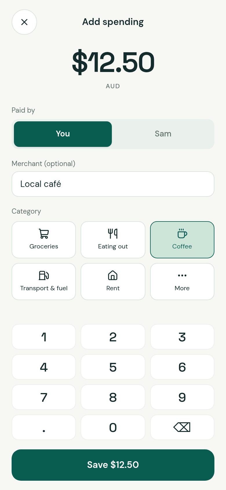 |
| 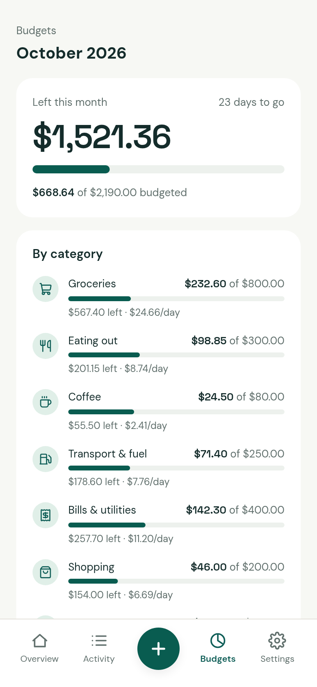 | 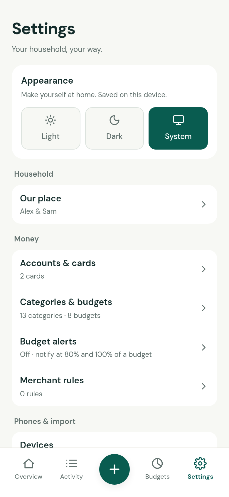 | 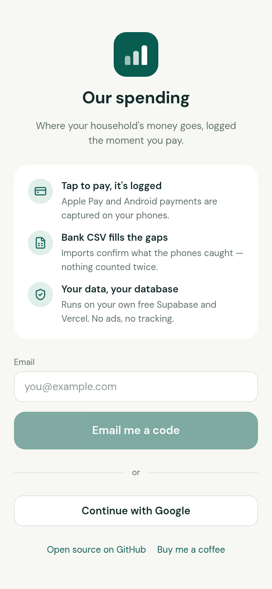 |
| 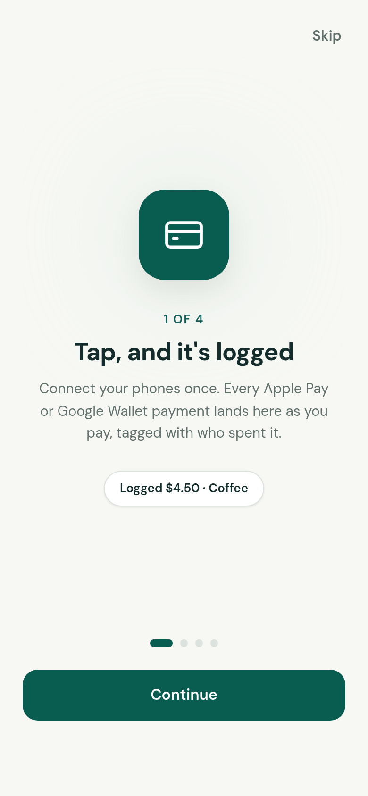 | 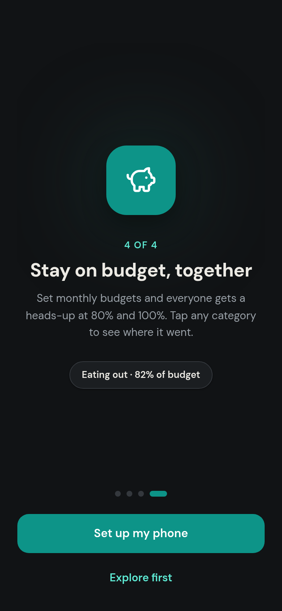 | |

</details>

## Deploy your own (free)

You need a free [GitHub](https://github.com/signup), [Vercel](https://vercel.com/signup) and [Supabase](https://supabase.com/dashboard/sign-up) account. It takes about 10 minutes.

1. **Click [Deploy with Vercel](https://vercel.com/new/clone?repository-url=https%3A%2F%2Fgithub.com%2FNebojsha-2026%2Four-spending&project-name=our-spending&repository-name=our-spending&integration-ids=oac_VqOgBHqhEoFTPzGkPd7L0iH6&demo-title=Our%20spending&demo-description=Shared%20household%20spending%20tracker%20with%20tap-to-pay%20capture).** Vercel copies the code into your GitHub and asks you to connect Supabase. Let it create a new Supabase project, choosing the region nearest you (Sydney: *ap-southeast-2*). The database tables are created automatically during the first deploy.
2. **Finish sign-in setup.** Sign-in emails need to carry a 6-digit code, and Supabase needs your app's address. Pick one:
   - **Automatic:** create a token at [supabase.com/dashboard/account/tokens](https://supabase.com/dashboard/account/tokens). Add it in Vercel under *Settings → Environment Variables* as `SUPABASE_ACCESS_TOKEN`, then redeploy (*Deployments → ⋯ → Redeploy*).
   - **By hand:** follow steps 3–4 of [manual setup](docs/manual-setup.md#supabase). It takes two minutes in the Supabase dashboard.
3. **Open your app**, sign in with your email, and create your household. Then add everyone else under *Settings → Household* (partner, family members or housemates). Each person joins when they first sign in with that email.
4. **Install it on your phones**: iPhone Safari → Share → **Add to Home Screen**; Android Chrome → ⋮ → **Install app**.
5. **Set up capture**: *Settings → Devices → Add a phone*. On Android it gives you a ready-made **MacroDroid macro** to download and import; on iPhone, a Shortcut to add (or step-by-step instructions). About 3 minutes per phone; details in the [phone guide](docs/phones.md).
   **Optional: budget alerts.** Set budgets in *Settings → Categories & budgets*, then on each phone open *Settings → Budget alerts → Turn on for this phone* ([details](docs/budget-alerts.md)). The push keys are created on the first deploy.
6. **Once everyone has signed in**, turn off *Allow new users to sign up* in Supabase (*Authentication → Sign In / Providers*), so nobody else can create an account on your app.

**Updating:** pull the latest version into your copy and push; Vercel redeploys and applies any new database changes first.

```bash
git clone https://github.com/<you>/our-spending && cd our-spending
git pull https://github.com/Nebojsha-2026/our-spending main
git push
```

### What "free" means

- **Vercel Hobby** is free for personal, non-commercial use, which a household app is.
- **Supabase Free** gives you a 500 MB database: years of household transactions. Free projects **pause after a week with no activity**; daily phone captures keep yours awake. If it does pause, press *Restore* in the Supabase dashboard; nothing is lost.
- Supabase's built-in email sender allows a few sign-in emails an hour, which is plenty for a household.

## Guides

- [Phone capture](docs/phones.md): iPhone Shortcuts and Android MacroDroid
- [Bank CSV import, Needs review and rules](docs/bank-import.md)
- [Budget alerts](docs/budget-alerts.md): notifications at 80% and 100% of a budget
- [FAQ](docs/faq.md): paused projects, "Card payment", duplicates, privacy, updating
- [Manual setup](docs/manual-setup.md): Supabase and Vercel step by step, without the deploy button
- [How it fits together](docs/architecture.md): code tour and local development

Built for Australian households: amounts are AUD, and weeks run Monday–Sunday in Sydney time. ANZ and NAB exports are read natively, and other banks' CSVs work through the generic importer.

## Support

This app is free and always will be. If it saves your household some money or some arguments, you can [buy me a coffee](https://buymeacoffee.com/npetreski) ☕. Bug reports and pull requests are welcome too. If your bank's CSV or notification wording isn't recognised, open an issue with a redacted sample.

## Licence

[MIT](LICENSE): use it, change it, share it.
